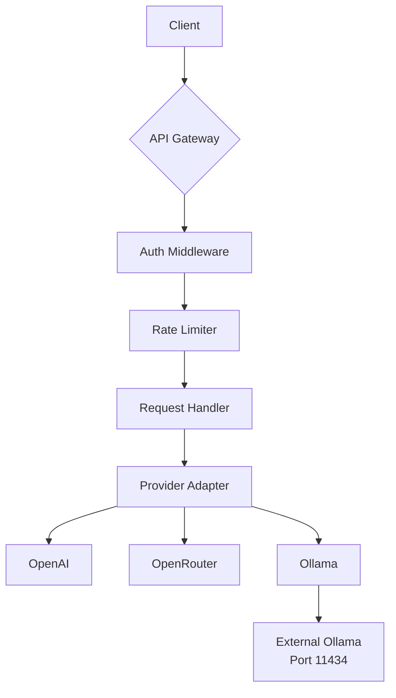

# LLM Gateway API - Unified Interface for Language Models


## Table of Contents
- [Project Overview](#project-overview)
- [Key Features](#key-features)
- [Getting Started](#getting-started)
  - [Prerequisites](#prerequisites)
  - [Installation](#installation)
  - [Configuration](#configuration)
- [API Documentation](#api-documentation)
- [Security Measures](#security-measures)
- [Docker Deployment](#docker-deployment)
- [Architecture](#architecture)
- [Roadmap](#roadmap)
- [Contributing](#contributing)
- [License](#license)

## Project Overview
The LLM Gateway API provides a unified interface to interact with multiple Large Language Model providers through a single, secure API endpoint. This solution abstracts provider-specific implementations, allowing seamless switching between OpenAI, OpenRouter, and Ollama with minimal configuration changes.

**Core Objectives**:
- 🚪 Provide a single gateway to multiple LLM providers
- 🔒 Implement enterprise-grade security protocols
- 📦 Enable simple Docker-based deployment
- 🧩 Support extensibility for new providers

## Key Features
- **Unified API Endpoint**: Single `/query` endpoint for all providers
- **Multi-Provider Support**:
  - OpenAI (GPT-3.5, GPT-4, etc.)
  - OpenRouter (access to multiple models)
  - Ollama (local/self-hosted models)
- **Secure Authentication**: JWT-based API token protection
- **Environment-Based Configuration**: `.env` file for sensitive data
- **Rate Limiting**: Prevent API abuse
- **Docker-Ready**: Production-ready containerization
- **Type-Safe**: Built with TypeScript for robust development
- **Standardized Responses**: Consistent JSON output format

## Getting Started

### Prerequisites
- [Bun](https://bun.sh/) v1.1.x
- [Docker](https://www.docker.com/) (for container deployment)
- API keys from providers (OpenAI, OpenRouter)
- Ollama instance available at port 11434

### Installation
```bash -->
# Clone repository
git clone https://github.com/your-username/llm-gateway.git
cd llm-gateway

# Install dependencies
bun install

# Copy environment template
cp .env.template .env
```

### Configuration
Edit the `.env` file with your credentials:

```env -->
# API Security
API_AUTH_TOKEN=your_secure_token_here
API_PORT=3000

# Provider Configuration
OPENAI_API_KEY=your_openai_key_here
OPENROUTER_API_KEY=your_openrouter_key_here

# Ollama Configuration (external instance)
OLLAMA_BASE_URL=http://ollama-host:11434

# Rate Limiting (requests per minute)
RATE_LIMIT=100
```

## API Documentation

### Base URL
`http://localhost:3000/api/v1`

### Authentication
Include API token in Authorization header:
```http -->
Authorization: Bearer <API_AUTH_TOKEN>
```

### Endpoints

**POST /query**
Submit a query to the LLM provider

Request Body:
```json -->
{
  "provider": "openai",
  "model": "gpt-4-turbo",
  "prompt": "Explain quantum computing in simple terms",
  "temperature": 0.7
}
```

Response:
```json -->
{
  "success": true,
  "response": "Quantum computing uses quantum bits...",
  "provider": "openai",
  "model": "gpt-4-turbo",
  "timestamp": "2025-06-19T12:34:56Z"
}
```

**GET /providers**
List available providers and models

Response:
```json -->
{
  "providers": [
    {
      "name": "openai",
      "models": ["gpt-4-turbo", "gpt-3.5-turbo"]
    },
    {
      "name": "ollama",
      "models": ["llama3", "mistral"]
    }
  ]
}
```

**GET /ollama-status**
Check connection to Ollama instance

Response:
```json -->
{
  "success": true,
  "ollama_available": true,
  "timestamp": "2025-06-19T14:30:45Z"
}
```

## Security Measures
- **API Token Authentication**: Mandatory for all endpoints
- **Environment Isolation**: Sensitive data stored in `.env` (excluded from repo)
- **Input Validation**: Strict schema validation for all requests
- **Rate Limiting**: Default 100 requests/minute
- **CORS Protection**: Origin restrictions enforced
- **HTTPS Enforcement**: Required in production environments
- **Connection Timeouts**: 30-second timeout for LLM responses
- **Sensitive Data Filtering**: No API keys in logs
- **Dependency Scanning**: Regular security audits

## Docker Deployment

### Docker Compose Configuration
```yaml -->
version: '3.8'

services:
  llm-gateway:
    build: .
    container_name: llm-gateway
    ports:
      - "3000:3000"
    env_file:
      - .env
    restart: unless-stopped
```

### Build and Run
```bash -->
# Build the image
docker-compose build

# Start the container
docker-compose up -d

# Check logs
docker-compose logs -f
```

### Production Notes
- Always use HTTPS in production
- Set `API_AUTH_TOKEN` to a strong, randomly generated value
- Regularly rotate API keys
- Consider adding a reverse proxy (Nginx, Caddy)

## Architecture


**Technology Stack**:
- **Runtime**: Bun v1.1.x
- **Framework**: Express.js
- **Language**: TypeScript v5.x
- **Containerization**: Docker
- **Testing**: Jest + Bun Test Runner

## Roadmap
### Phase 1: Core Functionality (MVP)
- [x] Unified query endpoint
- [x] OpenAI integration
- [x] OpenRouter integration
- [x] Ollama integration
- [x] Basic authentication
- [x] Docker deployment

### Phase 2: Enhanced Capabilities
- [ ] Response streaming support
- [ ] Usage analytics dashboard
- [ ] Dynamic provider registration
- [ ] Prompt templates
- [ ] Multi-modal support

### Phase 3: Enterprise Features
- [ ] Role-based access control
- [ ] Request queuing system
- [ ] Cost monitoring
- [ ] Audit logging
- [ ] Webhook notifications

## Contributing
Contributions are welcome! Please follow these guidelines:
1. Fork the repository
2. Create a new feature branch (`git checkout -b feature/your-feature`)
3. Commit your changes (`git commit -am 'Add your feature'`)
4. Push to the branch (`git push origin feature/your-feature`)
5. Open a pull request

**Requirements for Contributions**:
- All code must be written in TypeScript
- Include comprehensive tests
- Maintain 100% code coverage
- Update documentation accordingly
- Follow security best practices

## License
This project is licensed under the MIT License - see the [LICENSE](LICENSE) file for details.

---
**Disclaimer**: This project is provided as-is. Always secure your API endpoints and rotate credentials regularly when deploying in production environments.
